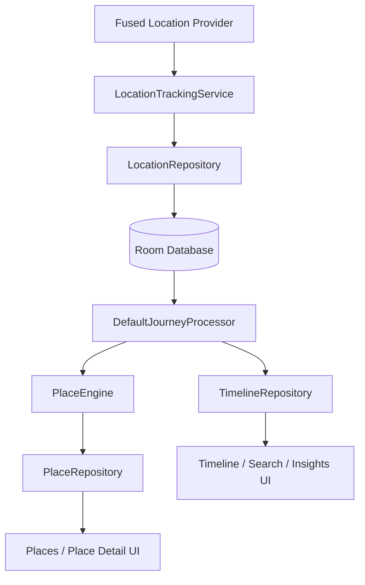

# Location Dots — Architecture

> **Source of truth:** this document describes the architecture that exists in the current repository, not planned package names.

## System overview

Location Dots is a Kotlin/Jetpack Compose Android application with a local Room database and a foreground location service.



The key design choice is that **raw location collection and semantic timeline processing are separate concerns**.

---

## Repository layers

### `core/`

Platform-facing contracts and utilities:

- location provider abstractions
- location permission handling
- navigation destinations
- notification helpers
- common result types

### `data/`

Persistence and repository implementations:

- Room database
- DAOs
- Room entities
- domain/data mappers
- location repository
- place repository
- timeline repository
- search repository
- insights repository

The database currently contains:

- `location_points`
- `places`
- `timeline_events`

### `domain/`

The application's semantic model and processing rules.

Important areas:

- `domain/model` — `LocationPoint`, `Place`, `TimelineEvent`, `JourneyMode`
- `domain/places` — `PlaceEngine` and place contracts
- `domain/journey` — `JourneyProcessor` and `DefaultJourneyProcessor`
- `domain/location` — location repository contract
- `domain/search` — search contract/model
- `domain/insights` — insights contract and snapshot model

The domain layer does not depend on Compose UI.

### `feature/`

Compose presentation grouped by user-facing feature:

- `about`
- `insights`
- `journey`
- `map`
- `onboarding`
- `place`
- `search`
- `settings`
- `splash`
- `timeline`

Most screens use ViewModels where stateful repository interaction is required.

### `service/`

Android service entry points:

- `LocationTrackingService` — owns continuous foreground location collection and triggers processing.
- `JourneyProcessingService` — currently exists as a service shell but is **not** the active processing pipeline.

### `ui/`

Shared Compose infrastructure:

- `AppBottomBar`
- expressive Material 3-inspired components
- MapLibre-backed `LocationMap`
- application theme

### `logging/`

Crash/diagnostic logging used by the application.

---

## Runtime data flow

### 1. Location collection

```text
FusedLocationProviderClient
        ↓
LocationTrackingService
        ↓
LocationRepository
        ↓
Room: location_points
```

The tracking service runs as a foreground service with `foregroundServiceType="location"`.

The UI exposes:

- High / Balanced accuracy
- 30 seconds / 1 minute / 5 minutes update intervals
- tracking on/off
- battery optimization guidance

### 2. Timeline processing

The tracking service periodically loads a processing window of stored location points and calls:

```text
DefaultJourneyProcessor.process(points)
```

The processor:

1. removes unusable points;
2. sorts points by timestamp;
3. builds spatial clusters;
4. confirms stationary visits;
5. resolves each visit through `PlaceEngine`;
6. creates journey events between visits;
7. replaces the affected timeline range in Room.

This means the timeline is a **derived representation** of stored location points.

---

## Visit detection

A visit is confirmed using the current constants in `DefaultJourneyProcessor`:

| Constant | Value |
|---|---:|
| `MIN_POINTS_PER_VISIT` | 5 |
| `MIN_DWELL` | 8 minutes |
| `STAY_RADIUS_METERS` | 100 m |
| `DEPARTURE_RADIUS_METERS` | 150 m |
| `DEPARTURE_CONFIRMATION_POINTS` | 2 |
| `MAX_ACCURACY_METERS` | 100 m |
| `STATIONARY_MAX_KMH` | 3 km/h |
| `STATIONARY_RATIO` | 70% |

A visit therefore requires both enough observations and enough time spent moving at stationary-like speeds.

### Place resolution

`PlaceEngine` calculates a robust cluster center using the median latitude and longitude.

It then searches for an existing nearby place using an accuracy-aware merge radius:

- minimum: **75 m**
- default accuracy contribution: **median accuracy × 1.5**
- maximum: **125 m**
- cluster spread is included in the radius calculation.

If a nearby place exists, it is reused. Otherwise a new place is persisted.

---

## Journey detection

For confirmed visits, the processor examines the location path between departure and the next arrival.

A journey is created only when the path distance reaches at least **100 m**.

The current speed-based classifier is:

| Average speed | Result |
|---|---|
| ≤ 7 km/h | Walking |
| > 7 and ≤ 25 km/h | Cycling |
| ≥ 35 km/h | Vehicle |
| 25–35 km/h | Unknown |

The classifier is deliberately simple and should be treated as an estimate, not sensor-level transport recognition.

---

## Persistence

Room is the source of truth for local history.

```text
LocationEntity
      │
      └── raw sampled location

PlaceEntity
      │
      └── resolved reusable place

TimelineEventEntity
      │
      ├── Visit
      └── Journey
```

Repositories expose domain-facing operations so feature code does not need to know Room implementation details.

---

## Presentation flow

```text
Room repositories
      ↓
ViewModels / MainActivity state
      ↓
Feature screens
      ↓
Shared Compose components
```

The current main navigation has four tabs:

1. Timeline
2. Places
3. Insights
4. Settings

Secondary screens include onboarding, search, place detail, journey detail, and About.

---

## Maps

Maps are isolated behind the shared `LocationMap` Compose component.

The map layer uses:

- MapLibre Native
- OpenFreeMap styles
- local place coordinates / journey paths

No Google Maps SDK is required.

See [MAPS_SETUP.md](MAPS_SETUP.md).

---

## Data import/export

Backup is implemented in `MainActivity` and exposed through Settings.

Export:

```text
Room data
   ↓
versioned JSON
   ↓
Android CreateDocument picker
```

Import:

```text
Android OpenDocument picker
   ↓
JSON validation
   ↓
preview counts
   ↓
user confirmation
   ↓
Room transaction
```

The current envelope identifies itself as:

```text
format = location-dots-local-export
version = 1
```

---

## Privacy boundary

The current application has no account or cloud location-history service.

Location data is persisted locally. Explicit export/import is user initiated.

The application does require network access for online map resources, so "local-first" should not be interpreted as "the app never uses the network."

---

## Build and release

The repository contains:

```text
.github/workflows/build-debug-apk.yml
.github/workflows/build-release-apk.yml
```

Release builds enable minification and resource shrinking. Release signing is conditional on the configured `secrets.properties` values.

---

## Testing boundary

Domain behavior is covered independently from Compose UI, including:

- place detection
- minimum eight-minute dwell behavior
- journey processing

The main logic to protect with regression tests is `DefaultJourneyProcessor` and `PlaceEngine`, because changes there directly alter the generated timeline.
