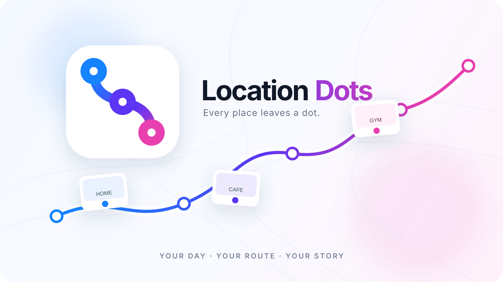

<div align="center">

# Location Dots

**Every place leaves a dot.**

A local-first Android location timeline that turns movement into **places, visits, journeys, and insights** — automatically.

[](https://developer.android.com/)
[](https://kotlinlang.org/)
[](https://developer.android.com/compose)
[](https://m3.material.io/)
[](#status)



</div>

---

## What it does

Location Dots continuously collects location points through an Android **foreground location service**, stores them locally, and processes those points into a readable timeline.

The intended flow is simple:

```text
Location updates
      │
      ▼
 Local Room database
      │
      ▼
Visit / journey processing
      │
      ├── Places
      ├── Visits
      └── Journeys
              │
              ▼
 Timeline · Maps · Search · Insights
```

> **Install → grant location access → live normally → come back to a timeline of your day.**

Tracking can continue while the app is not visible because the collector is a foreground service. The app does **not** request `ACCESS_BACKGROUND_LOCATION`.

## Product surface

| Timeline | Places | Insights | Settings |
|:---:|:---:|:---:|:---:|
| Daily history | Saved locations | Personal statistics | Tracking controls |
| Visits & journeys | Place history | Time & distance | Map appearance |
| Day separators | Interactive map | Movement summaries | Privacy & data |
| Route previews | Full-screen map | Activity breakdowns | Export / import |
| Timeline search | Rename places | — | Diagnostics |

### Core capabilities

- **Automatic place detection** — stationary clusters become visits and are resolved into reusable places.
- **Journey detection** — movement between confirmed visits becomes a journey with distance and an estimated mode.
- **Persistent timeline** — Room-backed history survives app restarts and supports paged timeline loading.
- **Place history** — open a place to inspect its visit history and edit its name.
- **Maps** — MapLibre Native with OpenFreeMap styles for places and journey routes.
- **Search** — search across the locally stored timeline/place data.
- **Insights** — derive statistics from stored visits and journeys.
- **Tracking controls** — high/balanced accuracy and 30-second, 1-minute, or 5-minute intervals.
- **Data portability** — export and import a versioned JSON backup.
- **Local data controls** — delete all stored location, place, and timeline data from Settings.
- **Battery diagnostics** — inspect battery optimization state and open the relevant Android settings.
- **Theme and appearance** — system/light/dark theme, animations, route-line visibility, place-marker visibility, and map-style selection.

## How a place becomes a dot

The current implementation is intentionally conservative. A short stop is not immediately treated as a place.

A visit must satisfy the current processor rules:

| Rule | Current value |
|---|---:|
| Minimum visit points | **5** |
| Minimum dwell time | **8 minutes** |
| Stay radius | **100 m** |
| Departure radius | **150 m** |
| Departure confirmation | **2 points** |
| Maximum accepted point accuracy | **100 m** |
| Stationary transition threshold | **≤ 3 km/h** |
| Required stationary transitions | **70%** |

Once a visit is confirmed, `PlaceEngine` calculates a robust center using the **median latitude/longitude** of the cluster. Existing places are reused when the new center falls inside an accuracy-aware merge radius.

The merge radius is bounded between **75 m and 125 m**, with location accuracy and cluster spread contributing to the calculated radius.

### Journey classification

Journeys require at least **100 m** of path distance. The current mode classifier uses average journey speed:

| Estimated speed | Mode |
|---|---|
| ≤ 7 km/h | Walking |
| > 7 and ≤ 25 km/h | Cycling |
| ≥ 35 km/h | Vehicle |
| Between those ranges | Unknown |

These are implementation thresholds, not a promise of perfect real-world transportation detection.

## Architecture

The repository follows a small layered structure:

```text
┌──────────────────────────────────────────────────────────┐
│ Compose UI / feature screens                             │
│ Timeline · Places · Journey · Search · Insights · Settings│
└────────────────────────────┬─────────────────────────────┘
                             │
┌────────────────────────────▼─────────────────────────────┐
│ Domain                                                    │
│ PlaceEngine · JourneyProcessor · domain models/contracts │
└────────────────────────────┬─────────────────────────────┘
                             │
┌────────────────────────────▼─────────────────────────────┐
│ Data                                                      │
│ Room · DAOs · entities · mappers · repositories           │
└────────────────────────────┬─────────────────────────────┘
                             │
┌────────────────────────────▼─────────────────────────────┐
│ Android / platform                                        │
│ Fused Location Provider · foreground service · permissions│
└──────────────────────────────────────────────────────────┘
```

The active background pipeline is:

```text
FusedLocationProvider
        ↓
LocationTrackingService
        ↓
LocationRepository / Room
        ↓
DefaultJourneyProcessor
        ↓
PlaceEngine
        ↓
TimelineRepository
```

See [ARCHITECTURE.md](ARCHITECTURE.md) for the repository-level breakdown.

## Tech stack

| Area | Implementation |
|---|---|
| Language | Kotlin 2.4 |
| UI | Jetpack Compose + Material 3 |
| Persistence | Room 2.8 |
| Async | Kotlin Coroutines / Flow |
| Location | Google Play services Location 21.3 |
| Maps | MapLibre Native 13.5 + OpenFreeMap |
| Build | Android Gradle Plugin 9.4 + KSP |
| Minimum Android | API 26 |
| Target Android | API 37 |

The current dependency graph does **not** include WorkManager or Activity Recognition; those were removed from the documentation because they are not part of the implemented stack.

## Permissions

The current manifest requests:

| Permission | Why it exists |
|---|---|
| `ACCESS_FINE_LOCATION` | Precise location tracking when granted |
| `ACCESS_COARSE_LOCATION` | Approximate location support |
| `FOREGROUND_SERVICE` | Required for the tracking service |
| `FOREGROUND_SERVICE_LOCATION` | Declares the foreground service's location type |
| `INTERNET` | Map tiles/styles and network-backed map resources |
| `WRITE_EXTERNAL_STORAGE` ≤ API 28 | Legacy compatibility for older Android versions |

**Not requested:** `ACCESS_BACKGROUND_LOCATION`.

## Privacy & data model

Location history is sensitive data, so the current prototype is designed around local storage.

- Location points, places, and timeline events are stored in **Room on the device**.
- There is no account/authentication layer in the current app.
- The application does not implement a cloud location-history backend.
- Export is explicit: the user chooses a destination for the JSON backup.
- Import requires a valid Location Dots backup format and shows a preview before confirmation.
- "Delete all local data" clears stored location points, places, and timeline events.
- Maps use an online map style, so map rendering is the main network-dependent part of the current app.

## Data backup format

Exports use a versioned JSON envelope:

```json
{
  "format": "location-dots-local-export",
  "version": 1
}
```

The importer validates both the format identifier and version before presenting an import preview.

## Maps

Location Dots uses **MapLibre Native** with **OpenFreeMap** styles. No Google Maps SDK or Google Maps API key is required.

Available map styles in the app:

- Liberty
- Bright
- Positron
- Dark
- Fiord

See [MAPS_SETUP.md](MAPS_SETUP.md) for map configuration and production notes.

## Repository layout

```text
app/src/main/java/com/locationdots/app/
├── core/          # platform contracts, permissions, navigation, notifications
├── data/          # Room, DAOs, entities, mappers, repositories
├── domain/        # location, places, journeys, search, insights
├── feature/       # Compose screens and feature ViewModels
├── service/       # foreground tracking and journey processing entry points
├── logging/       # crash diagnostics
└── ui/            # shared Compose components, maps, theme

app/src/test/       # domain tests
assets/             # repository artwork
.github/workflows/  # debug and release APK workflows
```

## Build

### Debug APK

The repository includes:

```text
.github/workflows/build-debug-apk.yml
```

### Release APK

The release workflow is:

```text
.github/workflows/build-release-apk.yml
```

Release builds enable R8/minification and resource shrinking. A release signing configuration is used when the expected values are provided through `secrets.properties`.

For local development, use the normal Gradle Android workflow from the repository root.

## Testing

The current automated domain coverage includes tests for:

- Place detection / merging behavior.
- Eight-minute minimum visit dwell behavior.
- Journey processing and movement classification.

The repository also keeps the domain processor separate from Compose UI so its core rules can be tested without rendering the application.

## Status

**Pre-release hardening**

The main prototype path is implemented. Current work is focused on release validation, edge cases, reliability, and polish rather than defining the core data model.

### Implemented

- [x] First-run onboarding
- [x] Foreground location tracking
- [x] Automatic visit/place detection
- [x] Journey processing
- [x] Persistent Room-backed timeline
- [x] Timeline pagination
- [x] Place detail and local renaming
- [x] Journey detail and route map
- [x] Places overview map
- [x] Timeline search
- [x] Insights
- [x] Tracking accuracy/interval controls
- [x] Map style and map visibility controls
- [x] JSON export/import
- [x] Delete-all local data
- [x] Diagnostics and battery optimization guidance
- [x] Debug/release APK workflows

### Deliberately not documented as implemented

The documentation previously listed several planned technologies/features as if they were active. They are intentionally omitted here until the code actually uses them:

- WorkManager
- Activity Recognition
- Android background-location permission
- Cloud sync/account infrastructure

---

<div align="center">

**Location Dots** · Local-first location history for Android

</div>
